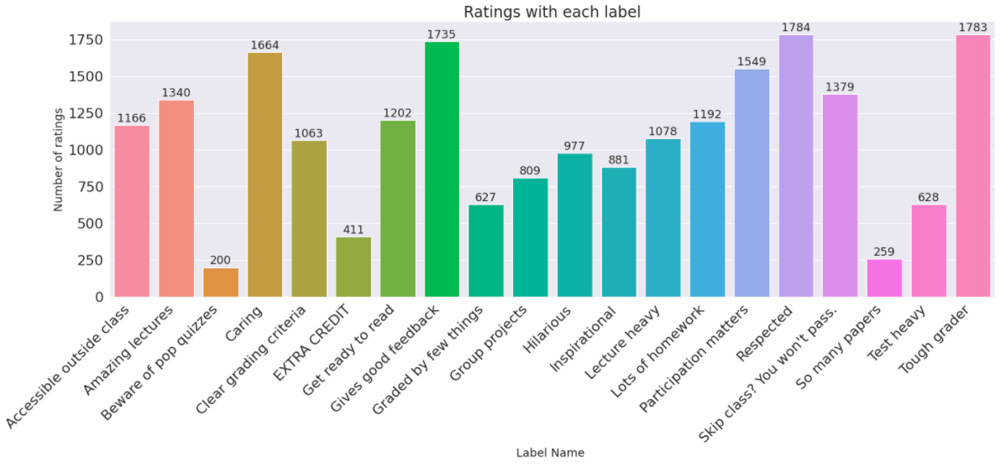
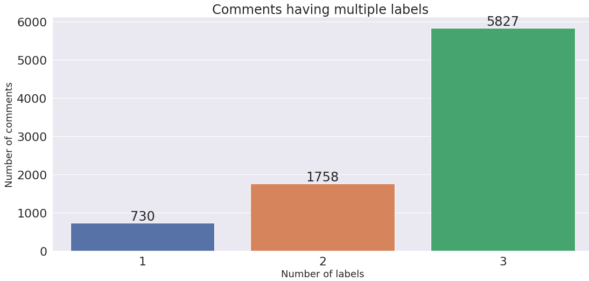

# Rebuild-My-Professor

Here is the repository for our course project at Vanderbilt: *CS 3891 Special Topics* (2020 Spring). We applied machine learning techniques in this project and worked on **rating tags prediction** and **rating visualization on radar chart** based on ratemyprofessors.com.

For rating tags prediction, we first embed the sentences into input vectors and then predict their corresponding top 3 rating tags out of the 20 tags available on ratemyprofessors.com. We experimented using weighted logistic regression based on TFIDF embedding as our base model. And we use a **biLSTM** model with a self-trained **Word2Vec** embedding that gave us the best result as our final model.

For radar chart visualization, we first perform **topic modelling** to gain insight into the data and choose dimensions of the radar chart. Then we manually label data for each category and apply **BERT** embedding to train a m**ulti-class classification model**. Finally, we calculate the score based on normalization and display the visualization on a simple web server.

**[TODO @ Ao] Sample Image**

**[Link to final presentation slides](https://docs.google.com/presentation/d/1wDA0UPp9di99CyNKslYld8N5JNcF7U2vHNoZgh-YVKo/edit?usp=sharing)**

## Dataset

We wrote a [web scraper](https://github.com/quao627/RMP) that connects to the site's public API to obtain data for our training. Check out the [Jupyter notebook demo](https://github.com/quao627/RMP/blob/main/demo.ipynb) for a sample output. Also, check out a [simple analysis](https://github.com/quao627/RMP/blob/main/RMP_EDA.ipynb) on the sample data.

We scraped the top 100 universities of [2021 Best U.S. University Rankings](https://www.usnews.com/best-colleges/rankings/national-universities).

- [School folder](https://drive.google.com/drive/folders/1JB2iQgBEiDR3a2NMkzh2_SfgiodStT8-?usp=sharing) contains all professors' information of each university, such as professor's name and overall rating score.
- **[Rating folder](https://drive.google.com/drive/folders/13WYlwAweXeQ3ZcRLOfh7f4kaiBL7sRNB?usp=sharing)** has all the review details for every professor of each university, such as comments, review date, or help count.
- In the above two folders, the file name corresponds to the university's I.D. number on the site, and [this sheet](https://docs.google.com/spreadsheets/d/1OmqnJeSWYc9WafFIwVyKHBm1RW-Mzgijc7RMauLujDQ/edit?usp=sharing) pairs each university's name with its I.D.

## Motivation

### About ratemyprofessors.com

Rate My Professors is a popular site among college students, allowing students to rate their professors and campuses. It was founded in May 1999 by a Menlo Park, CA-based software engineer named John Swapceinski. It is currently the largest professor rating site, boasting over 1.7 million professor reviews in over 7500 campuses across the U.S., U.K., and Canada. [1] It is beneficial as it provides references to students and feedback to professors. For example, first-year college students can view the professors' performances on the campus, which aids them to choose courses.

Professor ratings are closely related to college student choices. Given the site's enormous data, we focus on what insight we may get and how to improve the user experience by applying machine learning techniques. Through discussion of several ideas, we chose the following two to implement in the course:

### Tags Prediction

**Goal**: Automate the process of assigning tags to reviews based on their content. In other words, classify content into one or more classes.

**Motivation**: Many reviews on the Ratemyprofessor site don't have tags because the site introduces tagging feature afterwards. Therefore, the summary statistics on each professor's Ratemyprofessor web page may be misleading due to incomplete tagging.

**Expected Outcome:** The model performance will be evaluated using metrics that we commonly use for classification tasks such as cross-entropy or F1-score.

### Radar Chart Visualization

**Goal**: Summarize the ratings into numeric values on multiple dimensions and visualize the summarization through Radar Chart.

**Motivation**: Currently, on the site, we have tags associated with each professor. However, we wonder if there is a more intuitive way of summarizing the data? We propose translating each professor's ratings into numeric values of multiple dimensions through visualization tools and machine learning. For example, we can have a Radar Chart with six angles, which stands for the different dimensions. One dimension might be the 'amount of homework.' A higher number indicates there's much homework. We assigned scores to each of them and highlight the area enclosed by the shape. We believe that through visualization techniques like this, students obtain information more efficiently.

**Expected Outcome:** Since we don't have a ground truth for the task, we might manually label the data for classification purposes. Besides, to test if our tool helps increase efficiency, we may invite students to use the product and hear their feedback. Moreover, it might be helpful to have a tooltip integrated with the site to display our visualization.

## Project: Tags Prediction

### Methods

1. **Data Prep**:
    Since we will mainly focused on the review and tags, we seperate these columns from the whole dataset. After we remove all the comments with no tags, we follow the standard preprocessing process:
    1) Tokenization: splitting every comments into tokens.
    2) Nomalization: transverting every words/tokens to their original forms
    3) Removal of stop words: remove all the stop words(words that is too frequently used to be meaningful) from comments

2. **Data Visualization**:

We have finish the visualization of all the 20 tags and get a clear distribution. We can see that the number of comments for each tags varies a lot, which need to be balanced for a better modeling experience.

We also check the number of tags for every comments. Since the maximum number of tags in RateMyProfessor website is three, we can see only three tag numbers in thhis chart. Most comments includes three tags, while some of them includes one or two. The numbers remain a ratio about 1: 2: 7.

3. **Word Embedding**:

Here we are using our self trained [word2vec](https://github.com/xuezzou/Rebuild-My-Professor/blob/main/Tags-Prediction/Word_Embeddings.ipynb) model for process the dataset. Basically, Word2Vec represents each distinct word with different vectors. Due to the certain limitation of our dataset, like 'A' means a grade but not a determiner, we decided to train the word2vec model ourselves.

### Multi-label Classification

First of all, we need to understand what is multi-label classification. 
There are three kinds of classification tasks:
1. Binary classification: two exclusive classes
2. Multi-class classification: more than two **exclusive** classes
3. Multi-label classification: **non-exclusive** classes

Rating tags prediction, in our case, would be a sample of multi-label classfication.
To constructing a multi-label classification model we exxperienced with several choices:

- Simple Machine Learning Algorithms: Logistic regression 
- Deep Learning Methods: LSTM, BiLSTM, CNN

### Model Structures

#### Base Model
[Colab Notebook](https://github.com/xuezzou/Rebuild-My-Professor/blob/main/Tags-Prediction/BaseModel.ipynb)

Our base model uses TFIDF together with Logisitic regression and reached an average validation accuracy of 0.7899 with an average f1-score of 0.3584.

#### Final Model
[Colab Notebook](https://github.com/xuezzou/Rebuild-My-Professor/blob/main/Tags-Prediction/Tag_Classification_with_BiLSTM%2BCNN.ipynb)

We picked self-trained Word2Vec word embedding together with BiLSTM with CNN using binary cross entropy as loss function as our final model. It reached an average validation accuracy of 0.8275, recall of 0.7702, and an average f1-score of 0.7795.

## Project: Radar Chart

### Overview

Here's an illustration regarding how our process works.

1. **Data Prep**:
    See above Dataset Section.

2. **Topic Modelling**:
    We want to investigate what dimension we want our radar chart to reflect on. In other words, we want to know what classes we want for the model training process. We choose **clustering algorithms** to gain more insight into the structure of the data. We first apply **Bert embeddings** to the sentences and then apply the **UMAP** algorithm to reduce the dimensionality of the embeddings. Afterwards, we use **HDBSCAN** to perform clustering. We analyze the resulted clusters and summarize the topics.
   - Failed Attempt: We also try popular topic modelling methods such as **LDA**, but it doesn't yield relevant results due to a lack of semantics understanding of our task.

   

3. **Multiclass Classification Model Development**:
   After manually checking the clusters and choosing our topics, we manually label some data within the relevant clusters for training. To build the model, we apply **Bert embedding and a linear regression layer** for output. We also tried **Bert embedding with the LSTM model**.

4. **Score Calculation**:
   After model training, we apply normalization techniques and design a score calculation mechanism for later radar chart visualization.

5. **Web Visualization**:
   We set up a small python web server and display the final results using d3.js.

**Please refer [here 😊](./Radar-Chart) for detailed information on our methods.**

## References

[1] [Rate My Professors.](https://sites.google.com/view/ratemyprofessors-pc
) (2020). Google Sites.
