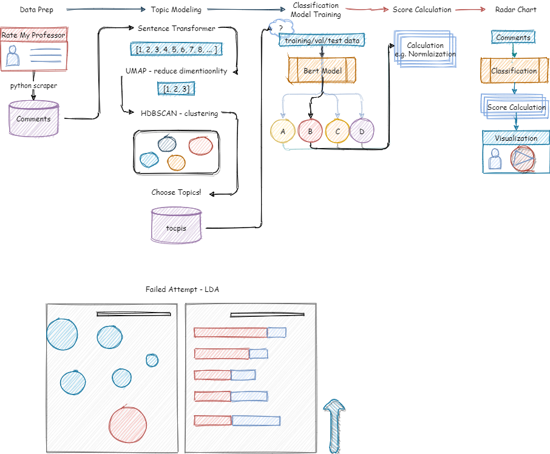
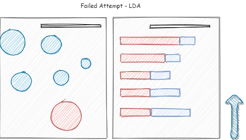
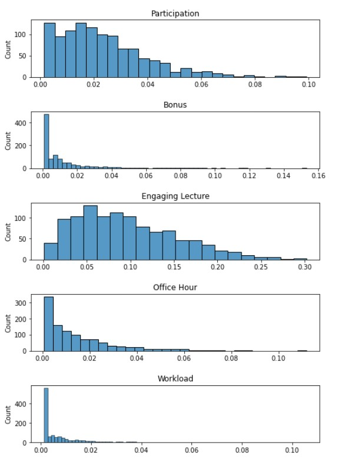

# Radar Chart Visualization

## Overview

Here's an illustration regarding how our process works.

1. **Data Prep**:
    See above Dataset Section.

2. **Topic Modelling**:
    We want to investigate what dimension we want our radar chart to reflect on. In other words, we want to know what classes we want for the model training process. We choose **clustering algorithms** to gain more insight into the structure of the data. We first apply **Bert embeddings** to the sentences and then apply the **UMAP** algorithm to reduce the dimensionality of the embeddings. Afterwards, we use **HDBSCAN** to perform clustering. We analyze the resulted clusters and summarize the topics.
   - Failed Attempt: We also try popular topic modelling methods such as **LDA**, but it doesn't yield relevant results due to the significant similarities between the sentences of our task.

   

3. **Multiclass Classification Model Development**:
   After manually checking the clusters and choosing our topics, we manually label some data within the relevant clusters for training. To build the model, we apply **Bert embedding and a linear regression layer** for output. We also tried **Bert embedding with the LSTM model**.

4. **Score Calculation**:
   After model training, we apply normalization techniques and design a score calculation mechanism for later radar chart visualization.

5. **Web Visualization**:
   We set up a small python web server and display the final results using d3.js.

## Methods

### Topic Modelling

- **[Collab notebook for topic modelling part](./Radar-Chart/topic-modelling-dim-reduction.ipynb)**

For this part, we are asking what topic we can frequently find in these sentences. We use **pre-trained Bert embedding** as it has shown exceptional results in various NLP tasks. Besides, Bert is pre-trained using a large corpus of data, and we believe they have a more accurate representation of words and sentences.

After applying the embeddings, each sentence becomes a 768-dimensional vector. However, most clustering algorithms work better on lower-dimensional data. Hence we use **UMAP** to reduce the dimensionality of the embeddings. Afterwards, we apply **HDBSCAN** for clustering, which stands for Hierarchical Density-Based Spatial Clustering of Applications with Noise.

After obtaining the clusters, we use the *class-based TF-IDF* to extract some keywords from each cluster. We also manually check sentences to observe what topics appear frequently. Besides, we reduce the number of topics by merging the most similar topic vectors.

**Topics**
We decide on six categories (5 topics + other):

1. (Others)
2. Participation matters
3. Have extra credit
4. Engaging lecture
5. Helpful office hour
6. Heavy workload

### Multiclass Classification

- **[Collab notebook for using [CLS] token from bert](./Radar-Chart/bert-cls-token.ipynb)**
- **[Collab notebook for bert + lstm](./Radar-Chart/bert-cls-token.ipynb)**

After deciding the topics, we manually label those clusters to prepare data for training. We apply two different model architecture. The first model uses ** Bert's pre-trained `[CLS]` token** with a linear layer, whereas our second model uses Bert's **pre-trained embedding on all words** and connect it to **LSTM** for training.

#### Sample Traning Sentences

1. "You should be fine as long as you go over the lectures!" - *Participation matters*
2. "He also give big curves and extra credit at the end." - *Have extra credit*
3. "Super interesting lectures and very friendly and hilarious!" - *Engaging Lecture*
4. "He has very generous office hours and is willing to help you if you have any questions." - *Helpful office hour*
5. "Expect lots of work - written quizzes twice a week, oral quiz once a week, and graded homework three times a week." - *Heavy workload*
6. "Doesn't reply to emails." - *Other*
7. "Also, he gives 5 pop-quizzes so beware." - *Other*
8. "Run, don't walk." - *Other*

#### Prevent Overfitting

To prevent Overfitting, we first reduce the network's capacity by removing layers or reducing the number of elements in the hidden layers. We also use Dropout layers, which will randomly remove certain features by setting them to zero. Besides, we apply regularization, which adds a cost to the loss function for large weights.

#### Metrics & Results

We evaluate both models using the training loss vs validation loss curve and class accuracy. The overall accuracy for both models is around 86%. Check out both notebook for more detailed information.

#### Score Calculation & Nomalization

To normalize the score calculation process later in the web server, we use a random sample of professors. We feed the sentences, run the model, and obtain each professors's raw score by averaging every sentence's softmax/probability output. Here is the distribution of each category from our sample data:

We then normalize the score to represent where it lies on the sample distribution. i.e. 80% means the raw score is better than 80% of that of all samples.

### Visualization & Web Server

The web server and visualization code are in the folder ( link here **[Todo @Ao]**). We use d3.js for visualization and flask for a simple web server. The current site supports comparison of up to 3 professors. The flow works like this 
- E.g. visit URL `http://127.0.0.1:5000/<prof_id>/<prof2_id>`
- Scrape data from rate my professor site
- Feed comments into the model
- Calculate score (normalized)
- Display Visualization

**How to run**
**[Todo @Ao]**

### Future work

**[todo]**